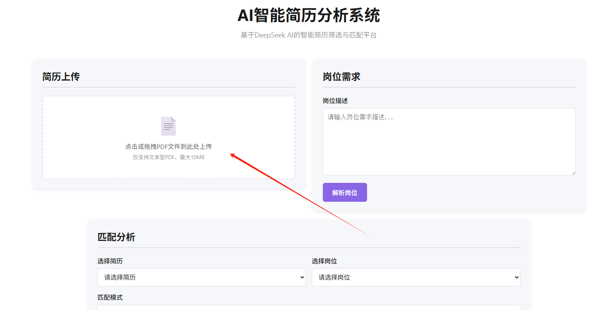
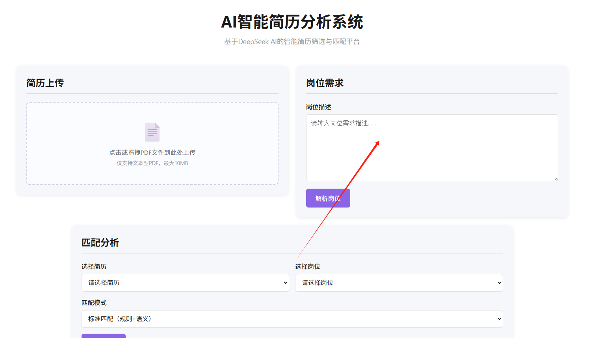
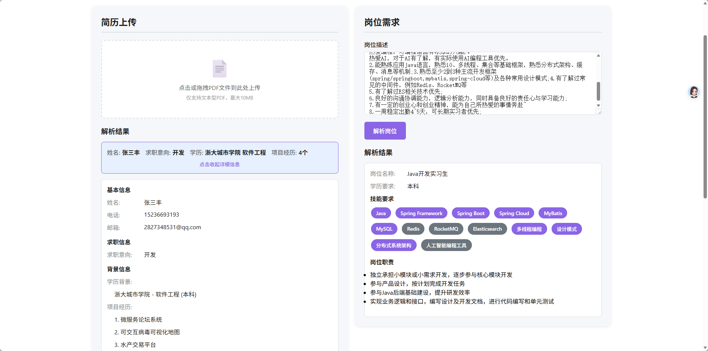
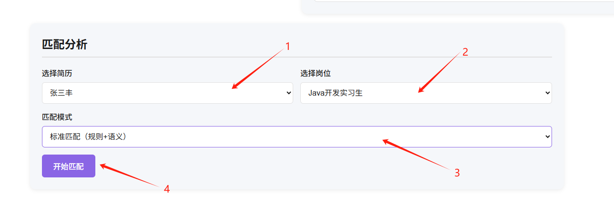
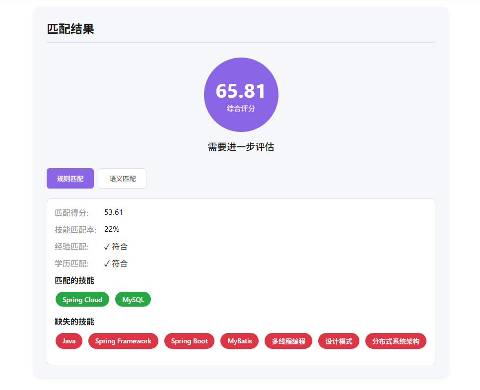
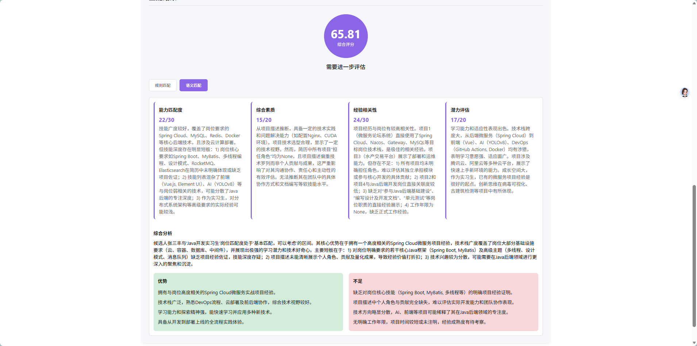

# AIResume

> 本项目是基于 DeepSeek 开发的 AI 简历分析匹配平台

## 目录

- [使用说明](#使用说明)
- [项目架构](#项目架构)
   - [整体架构](#整体架构)
   - [后端模块结构](#后端模块结构)
   - [前端结构](#前端结构)
   - [数据流](#数据流)
- [技术选型](#技术选型)
   - [后端技术栈](#后端技术栈)
   - [前端技术栈](#前端技术栈)
   - [基础设施](#基础设施)
- [部署方式](#部署方式)
   - [部署架构](#部署架构)
   - [部署步骤](#部署步骤)
      - [1. 后端部署（阿里云函数计算）](#1-后端部署阿里云函数计算)
      - [2. 前端部署（静态托管）](#2-前端部署静态托管)
      - [3. Redis部署](#3-redis部署)
      - [4. OSS部署](#4-oss部署)
   - [配置管理](#配置管理)
      - [配置文件](#配置文件)
      - [环境变量优先级](#环境变量优先级)
   - [监控和日志](#监控和日志)
      - [函数计算监控](#函数计算监控)
      - [日志查看](#日志查看)
   - [扩缩容](#扩缩容)
      - [自动扩缩容](#自动扩缩容)
      - [性能优化](#性能优化)
   - [回滚策略](#回滚策略)
      - [版本管理](#版本管理)
      - [备份策略](#备份策略)


---
# 使用说明
1. 访问 https://yydwjj.github.io/AIResume/ 进入简历分析系统首页

2. 点击或者拖拽上传简历进行解析
   
3. 将岗位描述复制进此区域，点击解析岗位进行解析
   
4. 解析完成后，结果如下
   
5. 在下方选择求职者以及岗位，并选择处理方式即可开始匹配
   
6. 匹配结果
   
   
# 项目架构

## 整体架构

本项目采用**前后端分离**的架构，后端部署在阿里云函数计算上，前端为静态HTML页面。

```
┌─────────────────────────────────────────────────────────┐
│                   用户浏览器                          │
└────────────────────┬────────────────────────────────┘
                     │ HTTP请求
                     ↓
┌─────────────────────────────────────────────────────────┐
│              阿里云函数计算                        │
│  ┌──────────────────────────────────────────────┐  │
│  │           Flask Web应用 (app.py)        │  │
│  │  ┌────────────────────────────────────┐   │  │
│  │  │  后端模块 (backend/)          │   │  │
│  │  │  ├── config/  配置管理      │   │  │
│  │  │  ├── core/    核心逻辑      │   │  │
│  │  │  ├── functions/  API处理函数  │   │  │
│  │  │  ├── utils/    工具类       │   │  │
│  │  │  └── data/     数据文件       │   │  │
│  │  └────────────────────────────────────┘   │  │
│  └──────────────────────────────────────────────┘  │
└────────────────────┬────────────────────────────────┘
                     │
        ┌────────────┼────────────┐
        ↓            ↓            ↓
   ┌────────┐  ┌────────┐  ┌──────────┐
   │ Redis  │  │  OSS   │  │ DeepSeek │
   │  缓存  │  │  存储   │  │   AI    │
   └────────┘  └────────┘  └──────────┘
```

## 后端模块结构

| 模块 | 功能 |
|------|------|
| **config/** | 配置管理（DeepSeek API、Redis、OSS、缓存等） |
| **core/** | 核心业务逻辑（PDF解析、文本清洗、信息提取、匹配算法） |
| **functions/** | API处理函数（简历上传、解析、岗位解析、匹配、任务状态） |
| **utils/** | 工具类（缓存、存储、任务管理、LLM客户端、辅助函数） |
| **data/** | 数据文件（技能数据库、技能学习数据） |

## 前端结构

```
frontend_dep/
├── index.html          # 主页面
├── css/
│   └── style.css      # 样式文件
└── js/
    ├── api.js         # API调用封装
    ├── resume.js      # 简历模块
    ├── job.js         # 岗位模块
    ├── match.js       # 匹配模块
    └── app.js         # 应用初始化
```

## 数据流

1. **简历上传流程**：
    - 用户上传PDF → Flask接收 → 保存到OSS → 创建解析任务 → 异步解析 → 保存到Redis

2. **岗位解析流程**：
    - 用户输入描述 → Flask接收 → 调用DeepSeek API → 解析结果 → 保存到Redis

3. **匹配分析流程**：
    - 用户选择简历和岗位 → Flask接收 → 检查缓存 → 规则匹配 + 语义匹配 → 保存结果 → 返回评分

4. **缓存机制**：
    - 简历解析结果：24小时
    - 岗位解析结果：7天
    - 匹配结果：24小时（按匹配模式区分）

---
# 技术选型

## 后端技术栈

| 技术 | 版本 | 用途 |
|------|------|------|
| **Python** | 3.10 | 主要开发语言 |
| **Flask** | - | Web框架，提供RESTful API |
| **Flask-CORS** | - | 跨域资源共享支持 |
| **PyPDF2** | - | PDF文本提取 |
| **Pillow** | - | 图像处理（PDF中的图片） |
| **redis-py** | - | Redis客户端，缓存管理 |
| **oss2** | - | 阿里云OSS客户端，文件存储 |

## 前端技术栈

| 技术 | 用途 |
|------|------|
| **HTML5** | 页面结构 |
| **CSS3** | 样式设计，响应式布局 |
| **JavaScript (ES6+)** | 前端逻辑，异步请求 |
| **Fetch API** | HTTP请求，与后端通信 |

## 基础设施

| 服务 | 用途 |
|------|------|
| **阿里云函数计算** | 无服务器计算，自动扩缩容 |
| **阿里云OSS** | 对象存储，保存PDF文件 |
| **Redis** | 缓存服务，提高响应速度 |
| **DeepSeek API** | AI服务，提供智能解析和匹配能力 |


---
# 部署方式

## 部署架构

本项目采用**Serverless架构**，后端部署在阿里云函数计算，前端为静态页面。

```
┌───────────────────────────────────────────────────┐
│                  用户访问                          │
└────────────────────┬──────────────────────────────┘
                     │
        ┌────────────┼────────────┐
        ↓            ↓            ↓
   ┌────────┐  ┌────────┐  ┌──────────┐
   │ 静态CDN│   │ 函数计算│  │  OSS存储  │
   │ (前端) │   │ (后端) │   │ (文件)   │
   └────────┘  └────────┘  └──────────┘
        │            │            │
        └────────────┼────────────┘
                     ↓
              ┌──────────┐
              │  Redis   │
              │  (缓存)   │
              └──────────┘
```

## 部署步骤

### 1. 后端部署（阿里云函数计算）

#### 1.1 创建函数
1. 登录阿里云控制台
2. 进入"函数计算" → "函数列表"
3. 点击"创建函数"
4. 选择"创建Web函数"
5. 配置参数：
    - 函数名称：`AIResume`
    - 弹性配置：`可以使用默认规格`
    - 运行环境：`自定义运行时->Python->Python 3.12`
    - 启动命令：`python3 app.py`
    - 监听端口： `9000`
    - 执行超时时间: `300s`

#### 1.2 配置环境变量
在函数配置中添加以下环境变量：

| 变量名 | 说明 |
|---------|------|
| `DEEPSEEK_API_KEY` | DeepSeek API密钥 |
| `REDIS_HOST` | Redis服务器地址 |
| `REDIS_PORT` | Redis端口 |
| `OSS_ENDPOINT` | OSS端点 |
| `OSS_BUCKET` | OSS存储桶名称 |
| `OSS_ACCESS_KEY_ID` | OSS访问密钥ID |
| `OSS_ACCESS_KEY_SECRET` | OSS访问密钥 |

#### 1.3 配置依赖
1. 在"层管理"中添加自定义层
2. 兼容运行时选择`python 3.12` `Debian11`
3. 上传方式选择在线构建依赖层
4. 复制backend目录下的`requirements.txt `文件,点击创建

#### 1.4 上传代码
1. 使用`package_project.ps1`脚本打包项目代码：
   ```powershell
   powershell -ExecutionPolicy Bypass -File package_project.ps1
   ```
2. 生成`airesume_deploy.zip`文件
3. 在函数配置中上传该ZIP文件
4. 设置启动命令：`python3 app.py`
5. 设置监听端口：`9000`

### 2. 前端部署（静态托管）
- GitHub Pages

### 3. Redis部署

#### 3.1 阿里云Redis
1. 创建Redis实例
2. 获取连接地址和端口
3. 配置白名单（允许函数计算访问）
4. 设置密码（可选）


### 4. OSS部署

1. 创建OSS Bucket
2. 设置访问权限为"公共读"
3. 配置跨域规则（CORS）
4. 创建目录结构：
   ```
   resumes/
   ```


## 配置管理

### 配置文件
主配置文件：`config.yaml`
> 请注意，代码仓库中提供的是`config.example.yaml`，需要复制并改名后使用

```yaml
deepseek:
  api_key: "your-api-key"
  base_url: "https://api.deepseek.com"
  model: "deepseek-chat"

redis:
  host: "your-redis-host"
  port: 6379

oss:
  endpoint: "oss-cn-beijing.aliyuncs.com"
  bucket: "your-bucket"
  access_key_id: "your-access-key"
  access_key_secret: "your-secret"

cache:
  resume_parse_ttl: 86400
  job_parse_ttl: 604800
  match_result_ttl: 86400
```

### 环境变量优先级
环境变量 > 配置文件 > 默认值

## 监控和日志

### 函数计算监控
- 请求次数和成功率
- 函数执行时间
- 错误率和异常
- 资源使用情况

### 日志查看
- 阿里云控制台 → 日志服务
- 实时日志查询
- 日志下载和导出

## 扩缩容

### 自动扩缩容
- 函数计算根据请求量自动扩缩容
- 无需手动管理服务器
- 按实际使用量计费

### 性能优化
- Redis缓存减少API调用

## 回滚策略

### 版本管理
- 每次部署保留历史版本
- 支持快速回滚到上一版本

### 备份策略
- Redis数据定期备份
- OSS文件自动备份
- 配置文件版本控制

---
